Homework 2
================
Yuki Joyama
2024-03-11

``` r
# load libraries
library(tidyverse)
library(rsample) # split data
library(caret)
library(splines)
library(mgcv)
library(earth)
library(ggplot2)
library(vip)

# library(tidymodels)
# library(plotmo)
# library(kknn)
# library(FNN) 
# library(pls)
```

``` r
# read csv files 
df = read_csv("./College.csv") |> 
  janitor::clean_names() |> 
  dplyr::select(-college) |> 
  dplyr::select(outstate, everything())

# partition (training:test=80:20)
set.seed(100)
data_split = initial_split(df, prop = .80)
train = training(data_split)
test = testing(data_split)
```

The college data is split into train (80%) and test (20%).

# (a) Smoothing Spline

``` r
# Function to fit smoothing spline model and return predicted values
fit_spline_model <- function(df, df_value) {
  fit.ss <- smooth.spline(df$perc_alumni, y = df$outstate, df = df_value)
  pred.ss <- predict(fit.ss, x = df$perc_alumni)
  return(data.frame(pred = pred.ss$y, perc = df$perc_alumni))
}

# Function to plot smoothed lines with different colors
plot_smooth_lines <- function(train, df_values, colors) {
  p <- ggplot(data = train, aes(x = perc_alumni, y = outstate)) +
    geom_point(color = rgb(.2, .4, .2, .5))
  
  for (i in seq_along(df_values)) {
    df_value <- df_values[i]
    color <- colors[i]
    
    pred.ss.df <- fit_spline_model(train, df_value)
    
    p <- p + geom_line(aes(x = perc, y = pred), data = pred.ss.df, color = color)
  }
  
  p <- p + theme_bw() 
  return(p)
}

# Set range of dfs 
df_values <- c(seq(2, 30, by = 2))
colors <- rainbow(length(df_values))

# Plot smoothed lines
plot_smooth_lines(train, df_values, colors)
```

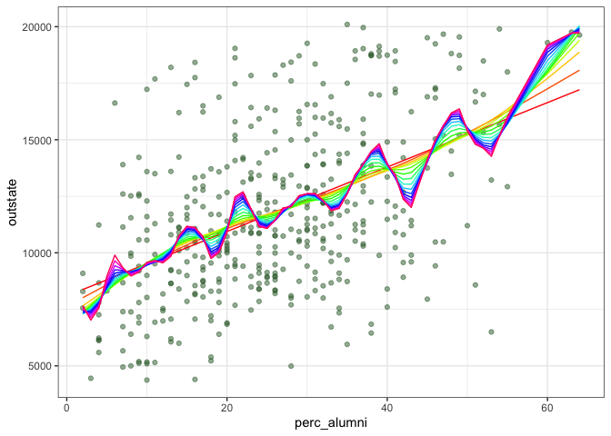<!-- -->

I set the range of degree of freedom (df) from 2 to 30 by 2 (2, 4, 6, …,
28, 30). The plot shows that as df increases, the fitted lines become
more wiggly.

To find the optimal df for the model, I will use Generalized
cross-validation.

``` r
# refit the model using GCV
fit.ss <- smooth.spline(train$perc_alumni, y = train$outstate, cv = FALSE) # determine tuning parameter by min GCV

pred.ss <- predict(
  fit.ss,
  x = train$perc_alumni
)

pred.ss.df <- data.frame(
  pred = pred.ss$y,
  perc = train$perc_alumni
)

# plot
p <- ggplot(
  data = train,
  aes(x = perc_alumni, y = outstate)
) +
  geom_point(color = rgb(.2, .4, .2, .5))

p + geom_line(
  aes(x = perc, y = pred), 
  data = pred.ss.df,
  color = "red"
) + theme_bw()
```

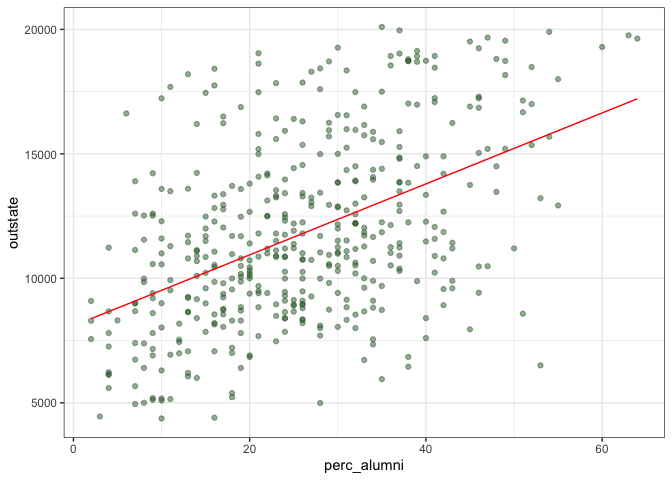<!-- -->

The selected df was 2 and the plot of this optimal fit is shown above.

# (b) Multivariate Adaptive Regression Splines (MARS)

``` r
# set up 10-fold cross validation 
ctrl <- trainControl(
  method = "cv",
  number = 10
)
```

``` r
set.seed(100)

# fit mars model
model.mars <- train(
  x = train[2:17],
  y = train$outstate,
  method = "earth",
  tuneGrid = expand.grid(degree = 1:5, nprune = 2:30),
  metric = "RMSE",
  trControl = ctrl
)

summary(model.mars$finalModel)
```

    ## Call: earth(x=tbl_df[452,16], y=c(11710,11000,1...), keepxy=TRUE, degree=1,
    ##             nprune=14)
    ## 
    ##                     coefficients
    ## (Intercept)           16332.5703
    ## h(apps-2095)              0.4519
    ## h(1673-accept)           -1.8329
    ## h(accept-1673)            0.5027
    ## h(903-enroll)             3.0624
    ## h(1251-f_undergrad)      -1.5629
    ## h(f_undergrad-1251)      -0.7315
    ## h(4980-room_board)       -0.9381
    ## h(ph_d-81)              111.2806
    ## h(8.3-s_f_ratio)       -396.6214
    ## h(27-perc_alumni)       -56.8440
    ## h(14820-expend)          -0.5965
    ## h(98-grad_rate)         -19.3291
    ## h(grad_rate-98)        -230.4300
    ## 
    ## Selected 14 of 21 terms, and 10 of 16 predictors (nprune=14)
    ## Termination condition: RSq changed by less than 0.001 at 21 terms
    ## Importance: expend, room_board, perc_alumni, accept, ph_d, f_undergrad, ...
    ## Number of terms at each degree of interaction: 1 13 (additive model)
    ## GCV 2669172    RSS 1066635330    GRSq 0.7986773    RSq 0.8212206

``` r
coef(model.mars$finalModel)
```

    ##         (Intercept)     h(14820-expend)  h(4980-room_board) h(f_undergrad-1251) 
    ##       16332.5702752          -0.5965124          -0.9381077          -0.7315103 
    ## h(1251-f_undergrad)   h(27-perc_alumni)        h(apps-2095)          h(ph_d-81) 
    ##          -1.5628566         -56.8439656           0.4518761         111.2806223 
    ##      h(accept-1673)      h(1673-accept)       h(903-enroll)     h(grad_rate-98) 
    ##           0.5027107          -1.8329192           3.0623761        -230.4299780 
    ##     h(98-grad_rate)    h(8.3-s_f_ratio) 
    ##         -19.3291086        -396.6213719

``` r
# best tuning parameters
model.mars$bestTune
```

    ##    nprune degree
    ## 13     14      1

``` r
plot(model.mars)
```

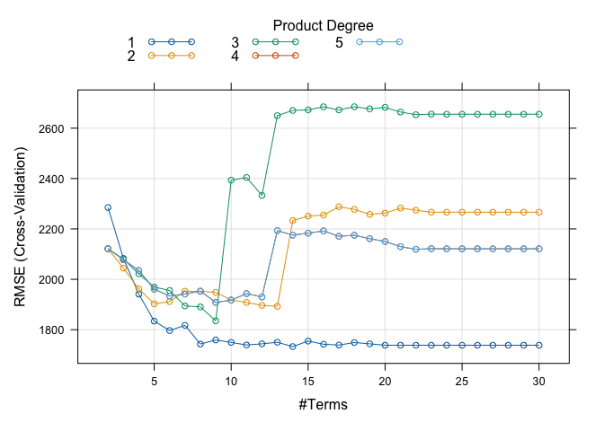<!-- -->

``` r
# relative variable importance
vip(model.mars$finalModel, type = "nsubsets")
```

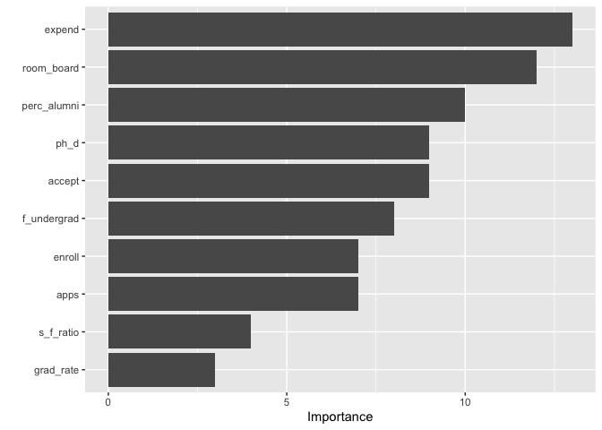<!-- -->

The final model can be expressed as the following:  
$$
\hat{y} = 16357.0585 
+ 1.2722 \times h(2095 - \text{apps}) 
+ 0.4506 \times h(\text{apps} - 2095) 
- 3.3926 \times h(1673 - \text{accept}) 
+ 0.5027 \times h(\text{accept} - 1673) \\
+ 3.2937 \times h(903 - \text{enroll}) 
- 1.6789 \times h(1251 - \text{f_undergrad}) 
- 0.7292 \times h(\text{f_undergrad} - 1251) 
- 0.9345 \times h(4980 - \text{room_board}) \\
+ 118.0087 \times h(\text{ph_d} - 81) 
- 424.6454 \times h(8.3 - \text{s_f_ratio}) 
- 53.5431 \times h(27 - \text{perc_alumni}) 
- 0.6097 \times h(14820 - \text{expend}) + \\
- 21.6454 \times h(98 - \text{grad_rate}) 
- 219.9621 \times h(\text{grad_rate} - 98)
$$ where $h(.)$ is hinge function.

``` r
# partial dependence plot of room_board, 
p1 <- pdp::partial(model.mars, pred.var = c("perc_alumni"), grid.resolution = 10) |> 
  autoplot()
p2 <- pdp::partial(model.mars, pred.var = c("room_board", "accept"), grid.resolution = 10) |> 
  pdp::plotPartial(levelplot = FALSE, zlab = "yhat", drape = TRUE, screen = list(z = 20, x = -60))

gridExtra::grid.arrange(p1, p2, ncol = 2)
```

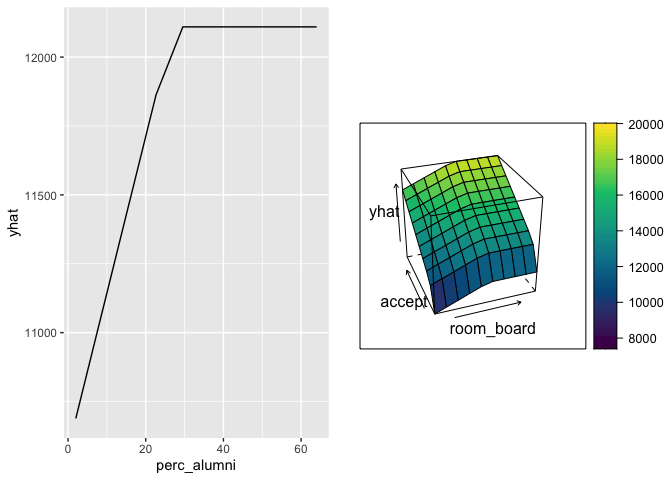<!-- -->

``` r
# Obtain the test error
mars.pred <- predict(model.mars, newdata = test)
mean((mars.pred - pull(test, "outstate"))^2) # test error
```

    ## [1] 4831325

The test error is $4.02\times10^6$

# (c) Generalized Additive Model (GAM)

``` r
set.seed(100)
model.gam <- train(x = train[2:17],
                   y = train$outstate,
                   method = "gam",
                   metric = "RMSE",
                   trControl = ctrl)

# check final model
model.gam$finalModel
```

    ## 
    ## Family: gaussian 
    ## Link function: identity 
    ## 
    ## Formula:
    ## .outcome ~ s(perc_alumni) + s(terminal) + s(books) + s(top10perc) + 
    ##     s(ph_d) + s(grad_rate) + s(top25perc) + s(s_f_ratio) + s(personal) + 
    ##     s(p_undergrad) + s(room_board) + s(enroll) + s(f_undergrad) + 
    ##     s(accept) + s(apps) + s(expend)
    ## 
    ## Estimated degrees of freedom:
    ## 2.18 1.00 1.89 1.33 4.51 3.79 1.00 
    ## 4.19 1.29 1.00 2.08 1.00 5.94 4.26 
    ## 5.04 5.17  total = 46.66 
    ## 
    ## GCV score: 2641859

The model includes all the predictors.  
Given the estimated degrees of freedom, I will select nonlinear terms
and plot each of them.

``` r
# plot
plot(model.gam$finalModel, select = 1)
```

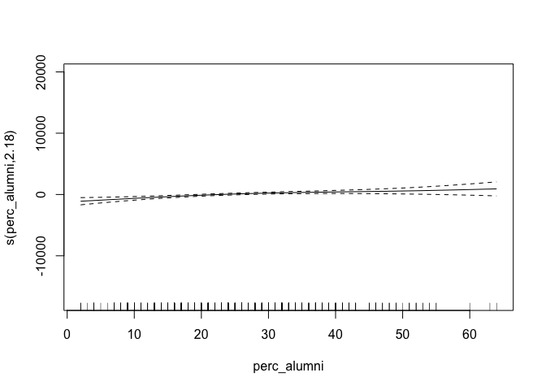<!-- -->

``` r
plot(model.gam$finalModel, select = 3)
```

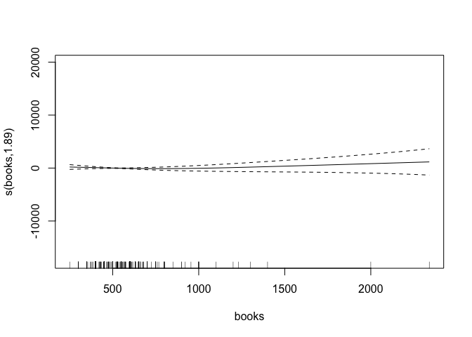<!-- -->

``` r
plot(model.gam$finalModel, select = 4)
```

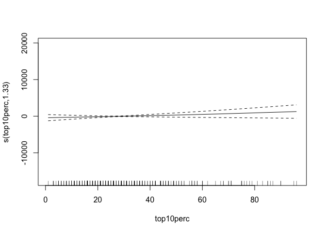<!-- -->

``` r
plot(model.gam$finalModel, select = 5)
```

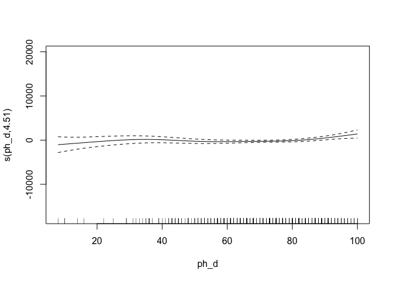<!-- -->

``` r
plot(model.gam$finalModel, select = 6)
```

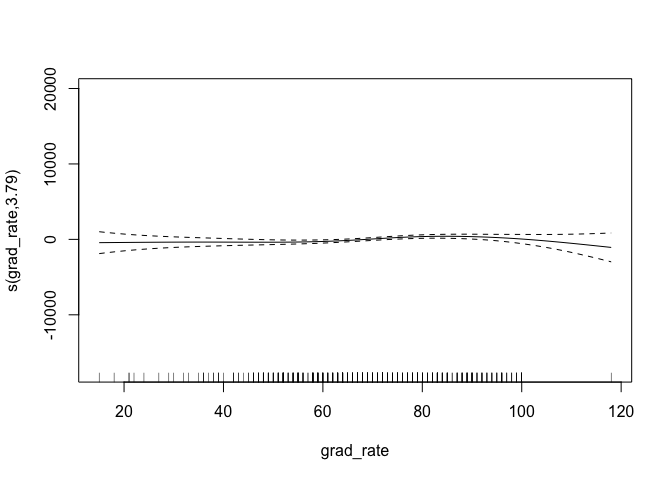<!-- -->

``` r
plot(model.gam$finalModel, select = 8)
```

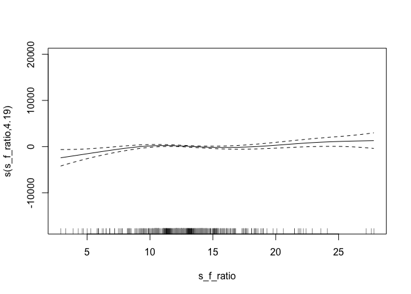<!-- -->

``` r
plot(model.gam$finalModel, select = 9)
```

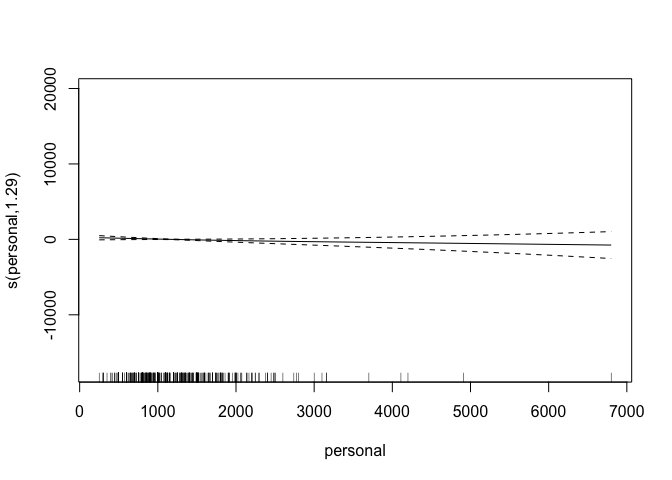<!-- -->

``` r
plot(model.gam$finalModel, select = 11)
```

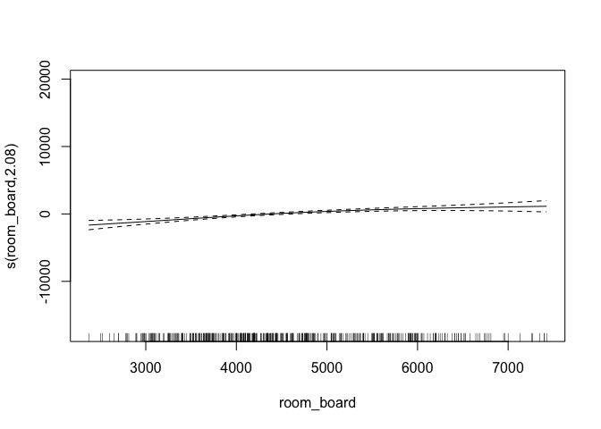<!-- -->

``` r
plot(model.gam$finalModel, select = 13)
```

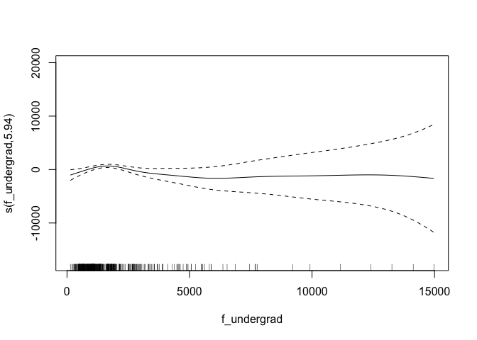<!-- -->

``` r
plot(model.gam$finalModel, select = 14)
```

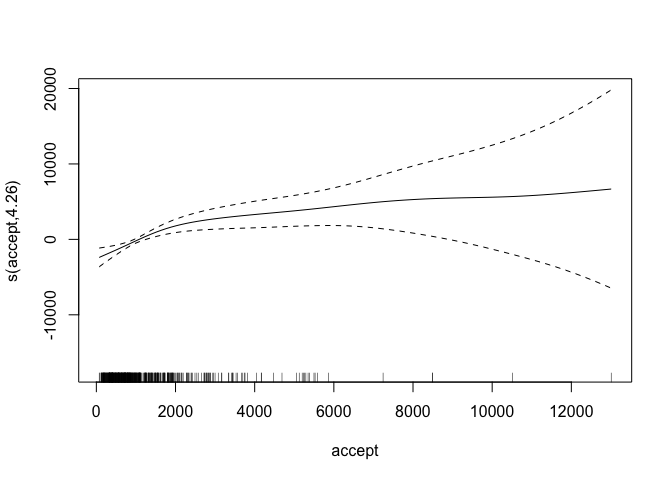<!-- -->

``` r
plot(model.gam$finalModel, select = 15)
```

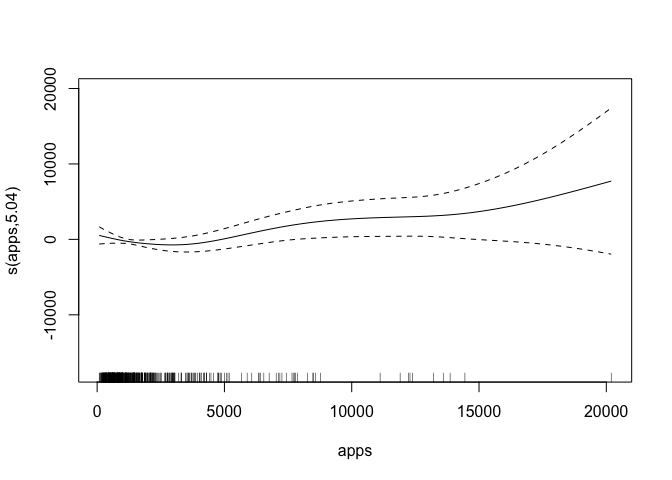<!-- -->

``` r
plot(model.gam$finalModel, select = 16)
```

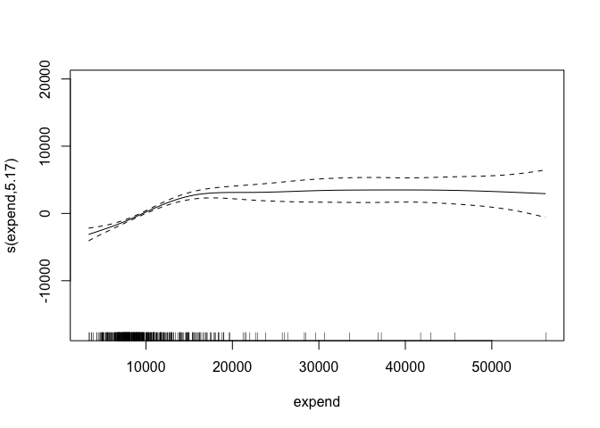<!-- -->

``` r
# Obtain the test error
gam.pred <- predict(model.gam, newdata = test)
mean((gam.pred - pull(test, "outstate"))^2) # test error
```

    ## [1] 3834108

The test error is $3.83\times10^6$

# d MARS vs linear model
